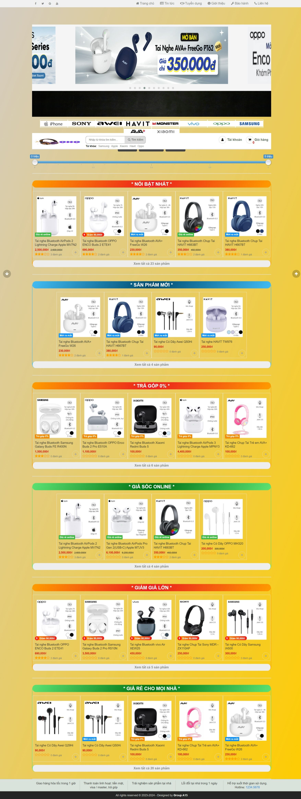
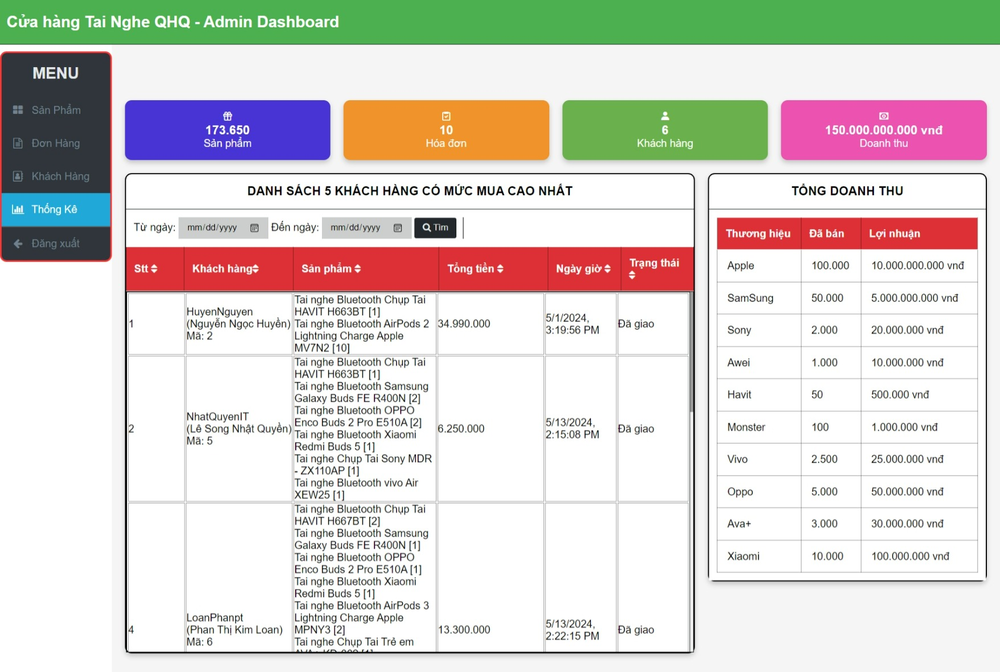

# WEB2
Nâng cấp từ WEB1 và Sử dụng HTML, CSS, Bootstrap, jQuery, Ajax, PHP, MySQL,...
# CỬA HÀNG BÁN LẺ TAI NGHE QHQ

### THÀNH VIÊN NHÓM
| STT |    MSSV    | Họ và tên                                                                   | Lớp |
| :-: | :--------: | --------------------------------------------------------------------------- | -------- |
|  1  | 3122411174 | [Lê Song Nhật Quyền](https://www.facebook.com/songquyen.it.vn) | DCT122C3 |
|  2  | 3121411090 | [Nguyễn Ngọc Huyền](https://www.facebook.com/profile.php?id=100028541111237) | DCT121C5 |
|  3  | 3122411172 | [Lương Thị Thùy Quyên](https://www.facebook.com/thuy.quyen.dangiu) | DCT122C3 |

## Demo

*TRANG CHU 

*ADMIN

## Các bước cài đặt:
1. Mở xampp, apache, MySQL
2. Bỏ folder project vào thư mục htdocs
2. Tạo mới database tên 'web2' kiểu utf8mb4_generalci trong phpmyadmin, rồi import file web2.sql vào
3. Chạy trang web từ localhost của XAMPP và tận hưởng thành quả

## Tài khoản admin
user: Admin
pass: 123

## Database
Database name: web2
User: root,
Pass: ""

## User mua hàng (6 tài khoản)
Username 1: LoanPhanpt, pass: beyeu123
Username 2: NhatQuyenIT, pass: 12345
Username 3: thuthuha444, pass: Haha9876*
Username 4: hongphuc333, pass: Phuc123#
Username 5: minhtuan222, pass: Tuantuan22@
Username 6: minhduc789, pass: Duc1234$
Users khác: Tự đăng ký và đăng nhập !

# Lưu ý: 
- Nếu có lỗi lấy dữ liệu, có thể do cài đặt kết nối database gặp bị sai, bạn vào BackEnd/ConnectionDB DB_driver.php chỉnh lại $host, $DbName, $user, $pass cho đúng với cài đặt phpmyadmin của máy bạn.
- Nếu XAMPP không chạy được thì tắt hẳn máy ảo VMware hoặc đổi cổng port mới. Ví dụ: localhost:8080
- Link repository: https://github.com/NhatQuyenIT/WEB2 
- Link github template pages: https://nhatquyenit.github.io/WEB2/